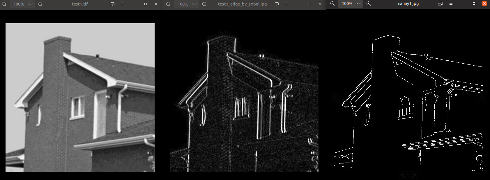
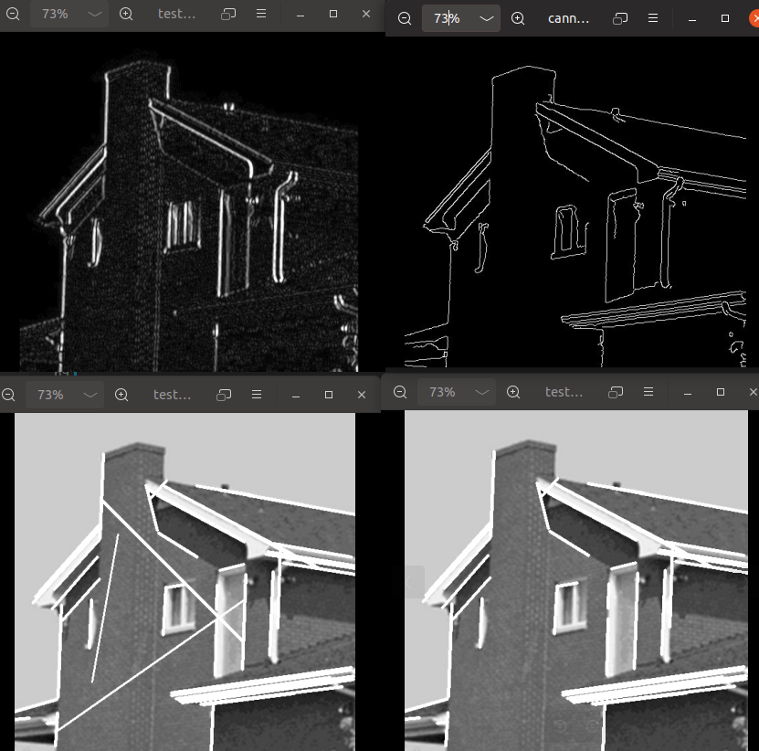
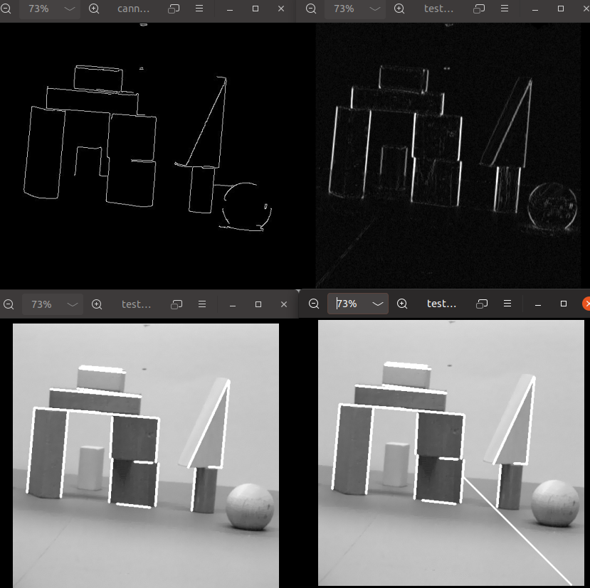
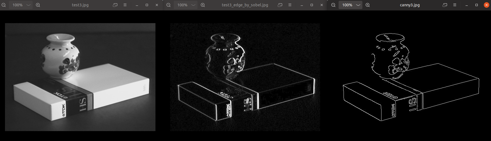
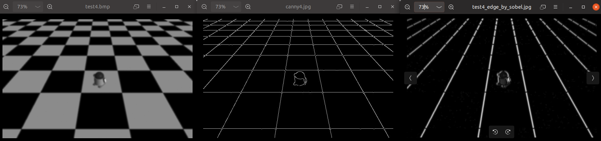
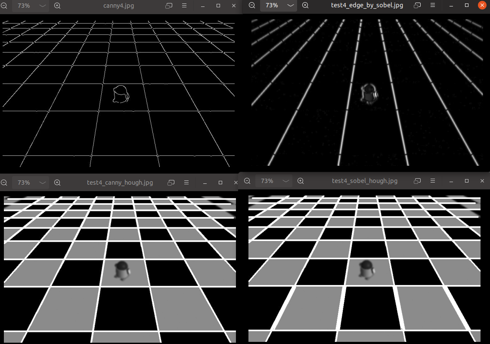
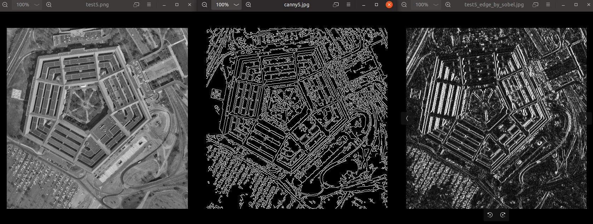
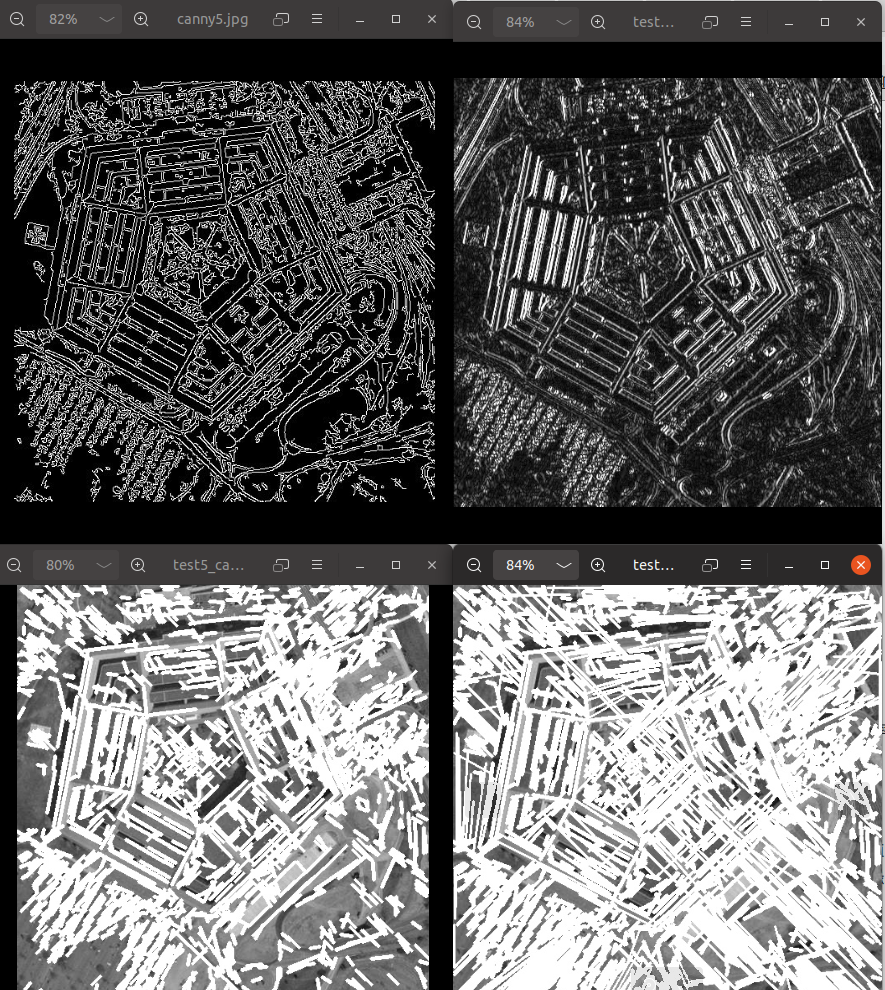
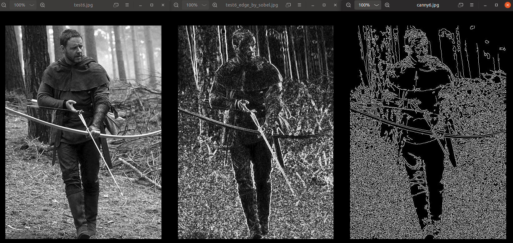
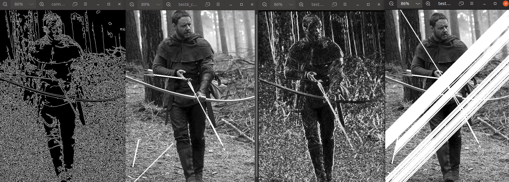

# Final Project 直线检测
--------------------
自动化52林汉宁
2150504042

## 作业要求
------------------------
1. 首先对测试图像（文件名为：test1~test6）进行边缘检测，可采用书上介绍的Sobel等模板或者cann算子方法；
2. 在边缘检测的基础上，用hough变换检测图中直线；
3. 比较不同边缘检测算法（2种以上）、不同hough变换参数对直线检测的影响；
4. 可以采用Matlab、OpenCV等自带函数。
## 摘要
-------------------------
本次实验基于Python+Opencv实现对图像的碧娜院检测与直线检测。分别使用Canny与Sobel木模板进行边缘检测，之后使用Hough变换检测图中直线。
## 实验内容
-----------------------
### 1.算法分析
- 边缘检测可使用canny sobel等算法，每种算法都有自己的算子，使用相应算子进行滤波即可。
再opencv 中有相应借口可方便实现。具体函数为
` cv2.Sobel`与`cv2.Canny`
- 在完成边缘检测后，使用hough变换检测图中直线。霍夫变换(Hough Transform)是图像处理中的一种特征提取技术，它通过一种投票算法检测具有特定形状的物体。该过程在一个参数空间中通过计算累计结果的局部最大值得到一个符合该特定形状的集合作为霍夫变换结果。在Opencv中可使用`cv2.HoughLinesP`函数实现hough变换直线检测。
### 2.结果展示与分析
-------------------------
#### test1：

- 对Canny 的霍夫变换minLineLength为10，maxLineGap为20
- 对Sobel处理后的霍夫变换minLineLength为200，maxLineGap为1
#### test2:

- 对Canny 的霍夫变换minLineLength为20，maxLineGap为30
- 对Sobel处理后的霍夫变换minLineLength为200，maxLineGap为1
 #### test3:

- 对Canny 的霍夫变换minLineLength为30，maxLineGap为30
- 对Sobel处理后的霍夫变换minLineLength为160，maxLineGap为1
 #### test4:

- 对Canny 的霍夫变换minLineLength为120，maxLineGap为30
- 对Sobel处理后的霍夫变换minLineLength为120，maxLineGap为1
 #### test5:

- 对Canny 的霍夫变换minLineLength为10，maxLineGap为3
- 对Sobel处理后的霍夫变换minLineLength为40，maxLineGap为1
 #### test6:

- 对Canny 的霍夫变换minLineLength为100，maxLineGap为3
- 对Sobel处理后的霍夫变换minLineLength为400，maxLineGap为1

#### 结论分析：
- Sobel法与Canny法对比，Canny得到的结果更好，Sobel留下细节过多。Canny法结果更适于继续进行直线检测。
- 针对Sobel法后Hough变换，由于细节过多，所以调参时minLineLength更大，maxLineGap更小。
- 当minLineLength更大，maxLineGap更小时得到直线结果变少。反之亦然。此结论可用于调参得到更好结果。
